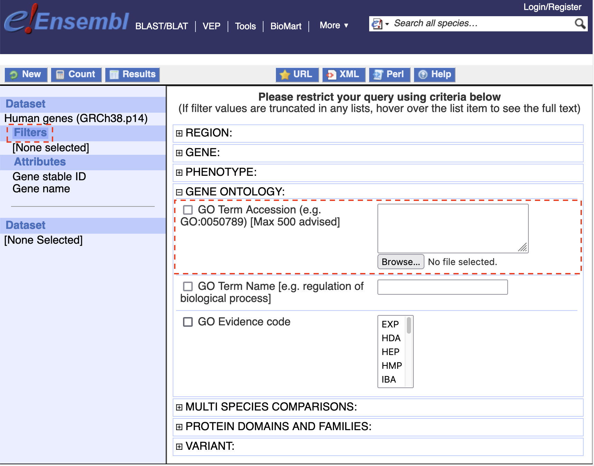
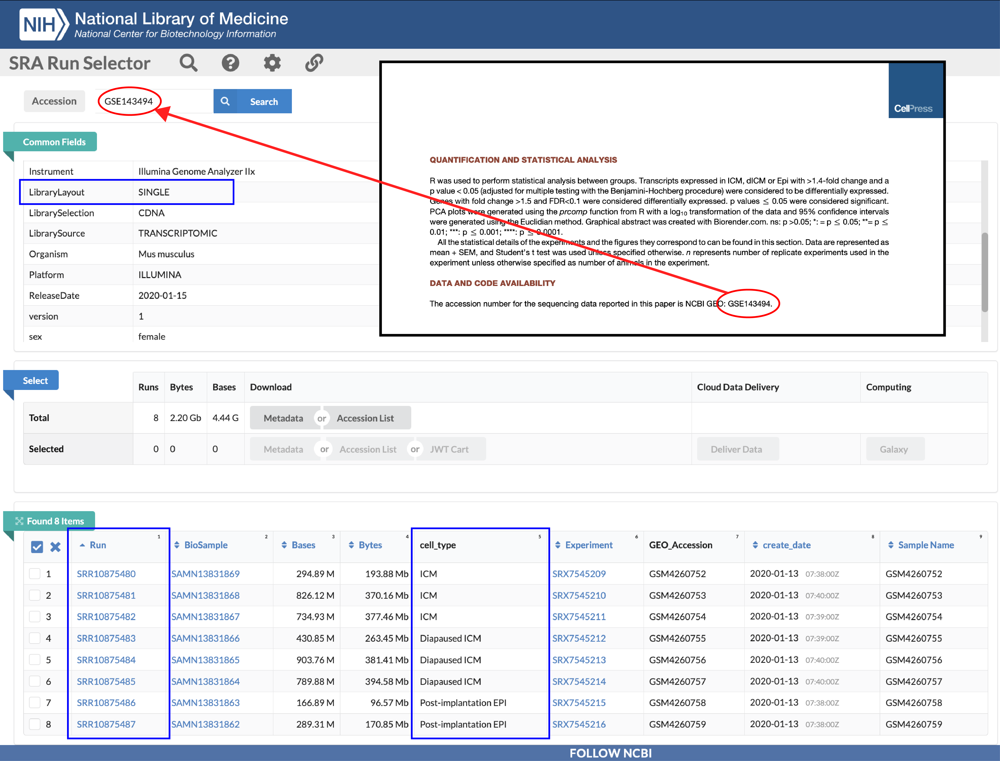

# Documentation
## AppendEnsemblIDColumn
>```AppendEnsemblIDColumn(ProteomicsDataFilePath, OutputDataFilePath, UniProtIDColumnName = "Protein IDs", To = "Ensembl")```

Appends a column of Ensembl IDs to the right of an Excel sheet with a column (named ```UniProtIDColumnName```) containing UniProtKB accession IDs. Depends on ```UniProtKBAC2EnsemblID``` (```To``` should be set as ```"WormBase"``` instead of the default ```"Ensembl"``` when working with *C. elegans* datasets).

## AppendNCBIGeneDescriptionColumn
>```AppendNCBIGeneDescriptionColumn(ExcelDataFilePath, ExcelDataFileEnsemblIDColumnName = "ensembl_gene_id")```

Appends a column of NCBI gene descriptions to the right of an Excel sheet with a column (named ```ExcelDataFileEnsemblIDColumnName```) containing Ensembl IDs. Depends on ```EnsemblID2Entrez```.

## BioMartGOFilter.*Nfurzeri*
>```BioMartGOFilter.Nfurzeri(GO.CSV, CombineFruitFlyHomology = FALSE, CombineHumanHomology = TRUE, CombineMedakaHomology = TRUE, CombineMouseHomology = TRUE, CombineNematodeHomology = FALSE, CombineXenopusHomology = TRUE, CombineZebrafishHomology = TRUE)```

>```merge.sets(set.a, set.b = c(), exception.set = c())```

>```write.gmt(GOList, GODescriptionOnly = FALSE, OutputFilePath = "custom.gmt")```

Use the [biomaRt](https://bioconductor.org/packages/release/bioc/html/biomaRt.html) package to get all *Nothobranchius furzeri* genes with GO term annotations in ```GO.CSV``` [note: (1) a term that ```regulates``` a BP is not considered as a child term of that BP in BioMart; (2) a protein ```located_in``` a protein complex (CC) is not necessary an integral ```part_of``` that protein complex (for example, [MTG1](https://www.uniprot.org/uniprotkb/Q9BT17/entry) is located in the [mitochondrial ribosome](https://www.ebi.ac.uk/QuickGO/term/GO:0005761), but it is not a mitochondrial ribosomal protein like [CHCHD1/MRPS37](https://www.uniprot.org/uniprotkb/Q96BP2/entry); see [this link](https://wiki.geneontology.org/Located_in#What_not_to_capture_with_the_has_input_relation) and [this link](https://wiki.geneontology.org/Part_of_relation#Relating_Gene_Products_to_Protein-containing_Complexes); the [Complex Portal](https://www.ebi.ac.uk/complexportal/home) is a good resource); (3) watch out for historical misannotations like [*rplp0-golga7*](https://www.ensembl.org/Nothobranchius_furzeri/Gene/Summary?db=core;g=ENSNFUG00015011674;r=sgr10:40066571-40071331) (two separate genes with non-overlapping coding sequences sharing the same Ensembl ID) and misleading names like [MRPS36/KGD4](https://www.uniprot.org/uniprotkb/P82909/entry) (which was found to not be a mitochondiral ribosomal protein) and [NDUFA4](https://www.uniprot.org/uniprotkb/O00483/entry) (which was found to be part of the respiratory complex IV rather than the respiratory complex I); (4) watch out for fusion genes like [*UBA52*](https://www.uniprot.org/uniprotkb/P62987/entry), [*RPS27A*](https://www.uniprot.org/uniprotkb/P62979/entry), and [*FAU*](https://www.uniprot.org/uniprotkb/P62861/entry), which code for ubiquitin-eL40, ubiquitin-eS31/S27a, and ubiquitin-like FUBI-eS30, respectively].

```CombineFruitFlyHomology```/```CombineHumanHomology```/```CombineMouseHomology```/```CombineMedakaHomology```/```CombineNematodeHomology```/```CombineZebrafishHomology``` allows complementation using the gene homology [to fly (*Drosophila melanogaster*)/human/medaka (*Oryzias latipes*)/mouse (*Mus musculus*)/nematode (*Caenorhabditis elegans*)/Xenopus (*Xenopus tropicalis*)/zebrafish (*Danio rerio*)] information. Note that this only works for Ensembl 113 (released on October 18th, 2024) or later. To include other available species, check out ```resources/EnsemblGenes[version#].txt```. 

The output is a list in which the name of each element is the Ensembl ID of a *N. furzeri* gene and the content of each element is the GO term annotations of that gene (supplemented with homology information). This list can then be converted into a .gmt file (for the gene set enrichment analysis) with ```write.gmt```. For example, the following script generates a .gmt file of all GO term annotations of all *N. furzeri* genes:

```R
BP <- BioMartGOFilter.Nfurzeri("GO:0008150")
CC <- BioMartGOFilter.Nfurzeri("GO:0005575")
MF <- BioMartGOFilter.Nfurzeri("GO:0003674")
write.gmt(c(BP, CC, MF))
# file.show("custom.gmt")
# as.character(openssl::sha1(file("custom.gmt")))
```

Use ```merge.sets``` for data curation. Given ```set.a```$= A$, ```set.b```$= B$, and ```exception.set```$= E$, we have ```merge.sets(A, B, E)```$=(A \cup B)\backslash E$.

## CorrelateOmics
>```CorrelateOmics(ProteomicsDataFilePath, UniProtIDColumnName = "Protein IDs", To = "Ensembl", GeneNameColumnName = "Gene name", ProteomicsColumnsToCalculateMean, TranscriptomicsDataFilePath, EnsemblIDColumnName = "ensembl_gene_id", TranscriptomicsColumnsToCalculateMean, RefreshGeneNames = TRUE)```

>```CorrelateOmics.log2FoldChange(ProteomicsDataFilePath, UniProtIDColumnName = "Protein IDs", To = "Ensembl", GeneNameColumnName = "Gene name", Proteomicslog2FoldChangeColumn, TranscriptomicsDataFilePath, EnsemblIDColumnName = "ensembl_gene_id", Transcriptomicslog2FoldChangeColumn, RefreshGeneNames = TRUE)```

>```plotCorrelateOmics(DataFrame, Alpha = 0.1, HighlightGeneNameRegex, HighlightAlpha = 1, HighlightColor = "#C40233", HighlightSize = 2.5)```

>```plotCorrelateOmics.log2FoldChange(DataFrame, Alpha = 0.1, HighlightGeneNameRegex, HighlightAlpha = 1, HighlightColor = "#C40233", HighlightSize = 2.5)```

```CorrelateOmics``` and ```CorrelateOmics.log2FoldChange``` link proteomics data in ```ProteomicsDataFilePath``` and transcriptomics data in ```TranscriptomicsDataFilePath``` (only proteins/genes with a one-to-one mapping will be included). If ```RefreshGeneNames``` is set as ```FALSE```, the result of ```CorrelateOmics``` will be a data frame with 5 columns: "logTranscriptomicsMean", "logTranscriptomicsStdev", "logProteomicsMean", "logProteomicsStdev", and "GeneName" (copied directly from the ```GeneNameColumnName``` column in ```ProteomicsDataFilePath```) and the result of ```CorrelateOmics.log2FoldChange``` will be a data frame with 3 columns: "Transcriptomicslog2FoldChange", "Proteomicslog2FoldChange", and "GeneName". If ```RefreshGeneNames``` is set as ```TRUE```, ```EnsemblID2Entrez``` (see below) will be deployed to re-download gene names from the NCBI Gene database, appending an additional ```CurrentEntrezGeneName``` column to the output data frame. The row names of the data frame are the corresponding Ensembl IDs. ```CorrelateOmics``` and ```CorrelateOmics.log2FoldChange``` pass the ```To``` input variable solely to ```UniProtKBAC2EnsemblID``` (```To``` should be set as ```"WormBase"``` instead of the default ```"Ensembl"``` when working with *C. elegans* datasets).

<!--
In rare cases when there are too many UniProtKB accession IDs in the proteomics data file, the line that executes the ID conversion step

```R
Table <- UniProtKBAC2EnsemblID(paste(All.UniProtKB.Entries, collapse = ","))
```

could be modified as follows to split the job into smaller jobs of ```PackageSize``` entries each.

```R
Table <- c()
for (i in 1 : ceiling(length(All.UniProtKB.Entries) / PackageSize)) {
  Package.UniProtKB.Entries <- All.UniProtKB.Entries[((i - 1) * PackageSize + 1) :
                                                     min(i * PackageSize, length(All.UniProtKB.Entries))]
  Package.Table <- UniProtKBAC2EnsemblID(paste(Package.UniProtKB.Entries, collapse = ","))
  Table <- rbind(Table, Package.Table)
}
```
-->

Subsequently, ```plotCorrelateOmics``` and ```plotCorrelateOmics.log2FoldChange``` can plot the output data frame of ```CorrelateOmics``` and ```CorrelateOmics.log2FoldChange```, respectively. To highlight certain genes, specify them by their NCBI gene names using the ```HighlightGeneNameRegex```.

Note: when encountering extremely small *p*-values (smaller than the machine epsilon $\epsilon = 2^{-52} \approx 2.2 \times 10^{-16}$ of an IEEE-754 double-precision number), ```R``` will report ```p-value < 2.2e-16```. This notion is also adopted by [WebGestalt](https://www.webgestalt.org/) when computing *p*-values via permutation-based analyses:

<p align="center">
$$p := \dfrac{\text{Permutation\# with more extreme statistics}}{\text{Total permutation\#}}$$,
</p>

wherein if no permutation yields a more extreme statistic, $`{-\text{lg}p}`$ will be ($+\infty$ according to the formula but) reported as $`{-\text{lg}(2^{-52})} \approx 15.65`$ instead.

## EnsemblID2Entrez
>```EnsemblID2Entrez(EnsemblID, Output = c("Accession", "ID", "Description", "Name"))```

>```BatchConvert2Entrez(EnsemblID.Xsv, X = "\n", Output)```

```EnsemblID2Entrez``` converts a single Ensembl ID to its corresponding NCBI Entrez accession(s)/ID(s)/description(s)/name(s) using the [rentrez](https://docs.ropensci.org/rentrez/) package. ```BatchConvert2Entrez``` batch converts a string (```EnsemblID.Xsv```) of Ensembl IDs delimited by ```X```. Use ```X = ""``` if ```EnsemblID.Xsv``` is already a set of individual Ensembl IDs. If the mapping does not exist, the output will be ```""```. This works better than using ```biomaRt``` because the mapping is more complete. And unlike using ```org.*.eg.db```, this works for all species.

Note: the default genome assembly of *Nothobranchius furzeri* on Ensembl is Nfu_20140520 while OrthoDB and the NCBI have opted for the newer UI_Nfuz_MZM_1.0 and NfurGRZ-RIMD1 genomes as their defaults, respectively (the UI_Nfuz_MZM_1.0 assembly has less unknown base pairs and more annotated genes owing to the long-read sequencing method, but the Nfu_20140520 assembly has a slightly higher BUSCO score; both NfurGRZ-RIMD1 and Nfu_20140520 are based on the commonly used GRZ-AD strain). This may cause differences in annotations. The UniProt reference proteome [UP000694548](https://www.uniprot.org/proteomes/UP000694548) is also based on Nfu_20140520, making it convenient to correlate omics.

## EnsemblIDFilter
>```EnsemblIDFilter(ExcelDataFilePath, BioMartExportFilePaths = NA, PassedEnsemblIDVector = NA, ExcelDataFileEnsemblIDColumnName = "ensembl_gene_id", BioMartExportEnsemblIDColumnName, ReAdjustPValues = TRUE, PValueColumnName = "pvalue", AdjustedPValueColumnName = "padj")```

Filters a [Flaski RNAseq pipeline](https://flaski.age.mpg.de/rnaseq/) output Excel sheet (```ExcelDataFilePath```) based on an vector of desired Ensembl IDs

- in ```PassedEnsemblIDVector``` or

- compiled from exported [Ensembl BioMart](https://www.ensembl.org/biomart/martview) TSV files whose paths are specified in ```BioMartExportFilePaths```, if ```BioMartExportFilePaths``` is not ```NA``` (note: this overrides the input variable ```PassedEnsemblIDVector```).

## FlaskiRenormalization
>```FlaskiRenormalization(Folder = getwd())```

Renormalize all samples contained in all .xlsx Flaski output data files in ```Folder``` based on DESeq2's "median of ratios".

## FindUniqueGenes.EnsemblID
>```FindUniqueGenes.EnsemblID(TargetSpecies, CheckHomologySpecies = c("drerio", "kmarmoratus"))```

Identifies genes of the ```TargetSpecies``` (returns a vector of their Ensembl IDs) without a homolog in ```CheckHomologySpecies```. Note: diapause III (delayed hatching), but no diapause II, can be observed in the life history of mangrove rivulus *Kryptolebias marmoratus*.

## GOFilter
>```GOFilter(ExcelDataFilePath, GOVector, godir, GOTermColumnName = "GO_id", ReAdjustPValues = TRUE, PValueColumnName = "pvalue", AdjustedPValueColumnName = "padj")```

Filters a Flaski RNAseq pipeline output Excel sheet (```ExcelDataFilePath```) based on the desired GO terms in ```GOVector``` [including all ```is_a``` child terms defined by ```godir```].

Note: Ensembl BioMart provides a built-in functionality to filter genes by GO term annotations (see the figure below; all child terms will also be included), which is better because a fresh download from Ensembl BioMart will reflect the most up-to-date GO term annotations. See ```BioMartGOFilter.Nfurzeri``` and ```EnsemblIDFilter```.

<p align="center">

</p>

## plotlogReadDistribution
>```plotlog2ReadDistribution(ExcelDataFilePath, DataColumns) # ln(x) / ln(2), x >= 1```

>```plotlnReadDistribution(ExcelDataFilePath, DataColumns) # ln(x + 1)```

Plots the smoothed empirical distribution function of all normalized reads (compiled from columns whose IDs/names are in ```DataColumns```) to help determine a threshold to filter genes with valid expression. This step is helpful when picking genes for further functional studies but dispensable if only bioinformatic analyses (like a [gene set enrichment analysis](https://www.pnas.org/doi/10.1073/pnas.0506580102)) are to be done.

## plotPCA
>```plotPCA(OmicsExcelDataFilePath, SampleColumns, GroupTags, FillColorPalette, PointSize = 2.5, ExpandRatio = 0.1, HideAxis = TRUE)```

Normalization of each dimension (centered so that the mean $\mu= 0$ and scaled so that the variance $\sigma^2= 1$) is by default (see [this](https://stats.stackexchange.com/q/189902)).

## samples.beeswarm
>```samples.beeswarm(GeneNameRegex, ExcelDataFilePath, GeneNameColumnName = "gene_name", ColumnOffset = 2, Group1RepNum, Group2RepNum, GroupTags, Colours = c("black", "red"), Standardized = 1, Breaks = 10, PointSize = 0.75, LineWidth = 0.5, AsteriskSignificance = TRUE, PValueColumnName = "pvalue", PValueDigit = 2)```

Plots a beeswarm plot of sample reads of gene(s) whose name(s) match the ```GeneNameRegex```. If ```Standardized = 1``` (or ```Standardized =  2```), the sample reads of each gene will be standardized by the mean of sample reads of group 1 (or 2) of each gene; otherwise, no standardization will be performed. The plot is automatically saved as a time-tagged figure in the working directory.

## SRX2SRR
>```SRX2SRR(SRXSheetFilePath, SRXColumnName = "SRX")```

Converts a column (from an Excel sheet ```SRXSheetFilePath```) of experiment numbers into corresponding run numbers (printed directly onto the console alongside the sequencing format employed). Note that this critical sequencing format info is not available in ```SRA_Accessions.tab``` (which allows batch searching using the corresponding SRP/PRJNA accession number directly) or ```SRA_Run_Members.tab``` (which allows batch searching using the corresponding SRP accession number) on [the FTP site](https://ftp.ncbi.nlm.nih.gov/sra/reports/Metadata/).

**Recommended alternative:** [the SRA Run Selector tool](https://www.ncbi.nlm.nih.gov/Traces/study/) provided by the NCBI (→ [tutorial](https://github.com/NCBI-Hackathons/ncbi-cloud-tutorials/blob/master/SRA%20tutorials/tutorial_SRA_run_selector.md)). We can get an overview of all the project's associated datasets by searching for the corresponding SRP/PRJNA/GSE accession number (see the figure attached below as an example for an overview of all datasets in [Hussein et al., *Developmental Cell*, 2020](https://www.sciencedirect.com/science/article/pii/S1534580719310676)).

<p align="center">

</p>

## UniProtKBAC2EnsemblID
>```UniProtKBAC2EnsemblID(UniProtKBAC.CSV, Wait = 5, To = "Ensembl")```

```UniProtKBAC2EnsemblID``` utilizes UniProt's REST API (which is more complete than ```biomaRt```) to convert UniProtKB accession IDs in ```UniProtKBAC.CSV``` into the Ensembl IDs of corresponding genes (note: since Ensembl inherits the WormBase IDs for *C. elegans* genes, ```To``` should be set as ```"WormBase"``` instead of the default ```"Ensembl"``` when converting *C. elegans'* genes). Once a job is submitted, the status will be inquired every ```Wait``` seconds until the job is finished. The downloaded output is then parsed into a matrix with two columns named ```uniprotsptrembl``` and ```ensembl_gene_id``` (consistent with BioMart). Each row corresponds to a mapping. If a protein/peptide is mapped to more than one Ensembl gene ID, multiple rows will share the same UniProtKB accession ID in column 1 but possess different Ensembl IDs in column 2.

## volcano.ma
>```volcano.ma(Data, PlotType = "ma", HighlightGeneNameRegex = NA, HighlightIDs = NA, GeneNameColumnName = "gene_name", IDColumnName = "ensembl_gene_id", log2FoldChangeColumnName = "log2FoldChange", Invertlog2FoldChange = FALSE, abslog2FoldChangeThreshold = 1, abslog2FoldChangeLimit = 3, log2FoldChangeLabel, log2FoldChangeTickDistance = 1, baseMeanColumnName = "baseMean", log2baseMeanLowerLimit = 0, log2baseMeanUpperLimit = NA, AdjustedPValueColumnName = "padj", SignificanceThreshold = 0.01, negativelog10AdjustedPValueLimit = 15, log10AdjustedPValueTickDistance = 5, LineWidth = 0.25, Stroke = 0.1, Shape = 21, Alpha = 1, NSAlpha = 0.1, UpColor = "#FFD300", DownColor = "#0087BD", HighlightColor = "#C40233", HighlightSize = 2.5)```

Plots a volcano plot (```PlotType = "volcano"```) or an MA plot (```PlotType = "ma"```) and highlight genes with an ID in ```HighlightIDs``` or with a name matching the ```HighlightGeneNameRegex``` pattern. Points beyond limits (defined by ±```abslog2FoldChangeLimit```, ```log2baseMeanLowerLimit```, ```log2baseMeanUpperLimit```, and ```negativelog10AdjustedPValueLimit```; ignored if ```NA```) will be coerced onto the border.

Note while using [plotly](https://plotly.com/r/)::```ggplotly``` to view and interact with the graph: the axis titles should be adjusted to avoid an error. For the volcano plot, use

```R
Plot <- Plot + xlab("log2(fold change)") + ylab("-log10(adjusted p)")
ggplotly(Plot)
```

For the MA plot, use

```R
Plot <- Plot + xlab("log2(base mean)") + ylab("log2(fold change)")
ggplotly(Plot)
```
## write.gmt.EC
> ```write.gmt.EC(ECIndexFilePath, organism_id, To = "Ensembl", AppendGODescription = FALSE, LowCountThreshold = 5, IgnoreLevel = c(0, 1), GMTFilePath)```

Writes a .gmt file for [IUBMB Enzyme Commission (EC) numbers](https://www.enzyme-database.org/) listed in the description file ```ECIndexFilePath``` of a species specified by ```organism_id``` (e.g., ```"105023"``` for *N. furzeri*, ```"6239"``` for *C. elegans*). This function is based on UniProt's database search. Conversion of UniProt's accession IDs to corresponding Ensembl IDs is also handled by UniProt's REST API (depending on ```UniProtKBAC2EnsemblID```: ```To``` should be set as ```"WormBase"``` instead of the default ```"Ensembl"``` when converting *C. elegans'* genes). ECs with fewer than ```LowCountThreshold``` entries will not be written into the .gmt file (which will also be filtered out in the downstream GSEA anyway).

Usually, it is not particularly informative to look at extremely broad categories like "EC 1: oxidoreductases". Therefore, we can set  ```IgnoreLevel``` properly to ignore these top levels of classifications.

For comprehensive mapping of EC to GO (MF), see [this](https://current.geneontology.org/ontology/external2go/ec2go).

## write.gmt.KEGG
> ```write.gmt.KEGG(Species3Letters, BioMartDataset, SpeciesSuffix, DescriptionFilePath = "DescriptionOnly.tsv", GMTFilePath = "KEGG.gmt")```

Writes a .gmt file and a description file for all [KEGG pathways](https://www.genome.jp/kegg/pathway.html) (and the Ensembl IDs of their associated genes based on [KEGG Orthology](https://www.genome.jp/kegg/ko.html)) of a species specified by ```Species3Letters``` (e.g., ```"nfu"``` for *N. furzeri*), ```BioMartDataset``` (e.g., ```"nfurzeri_gene_ensembl"``` for *N. furzeri*), and ```SpeciesSuffix``` (e.g., ```" - Nothobranchius furzeri"``` for *N. furzeri*). The conversion of an NCBI Entrez ID to its corresponding Ensembl ID is handled by BioMart and may not be complete.
